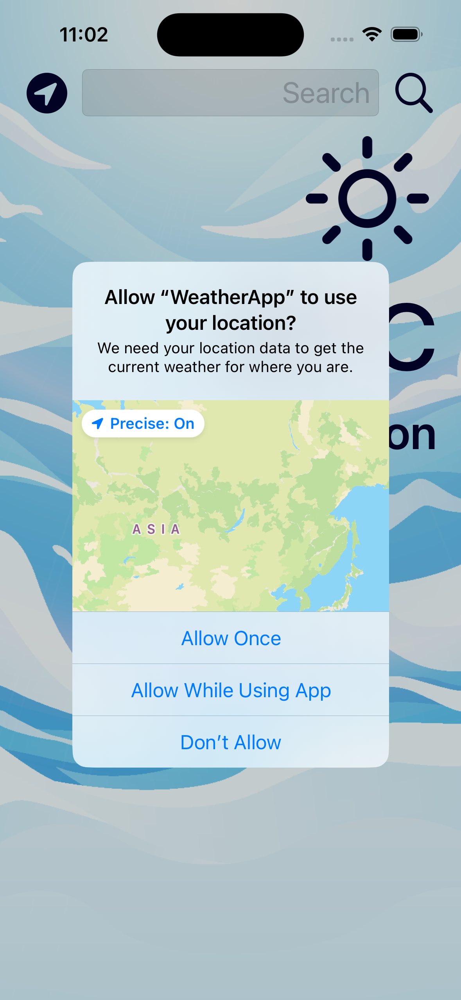
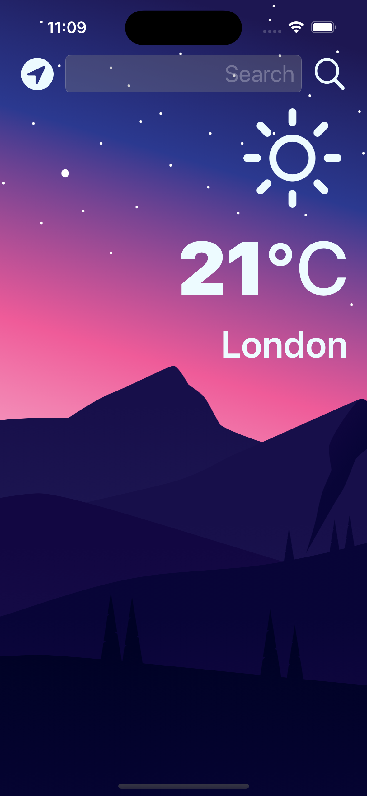

#  WeatherApp

## Description

UIKit single screen weather app built using OpenWeather API key. There is an ability to check local weather based on user's location from the phone GPS.

## Main features

* MVC design pattern.
* Delegate design pattern.
* Dark-mode enabled app.
* Swift protocols and extensions. 
* Swift closures and completion handlers.
* Using URLSession to network and making HTTP requests.
* Parsing JSON with the native Encodable and Decodable protocols. 
* Using Grand Central Dispatch to fetch the main thread.
* Using Core Location to get the current location. 

## Simulator screenshots

 
